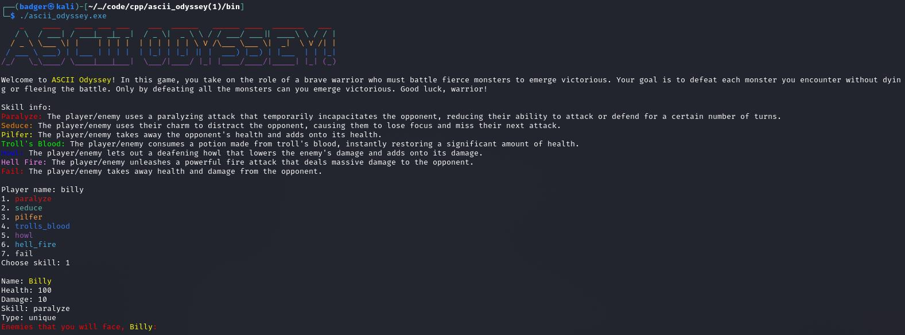
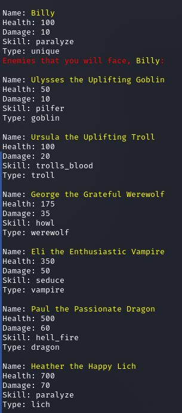
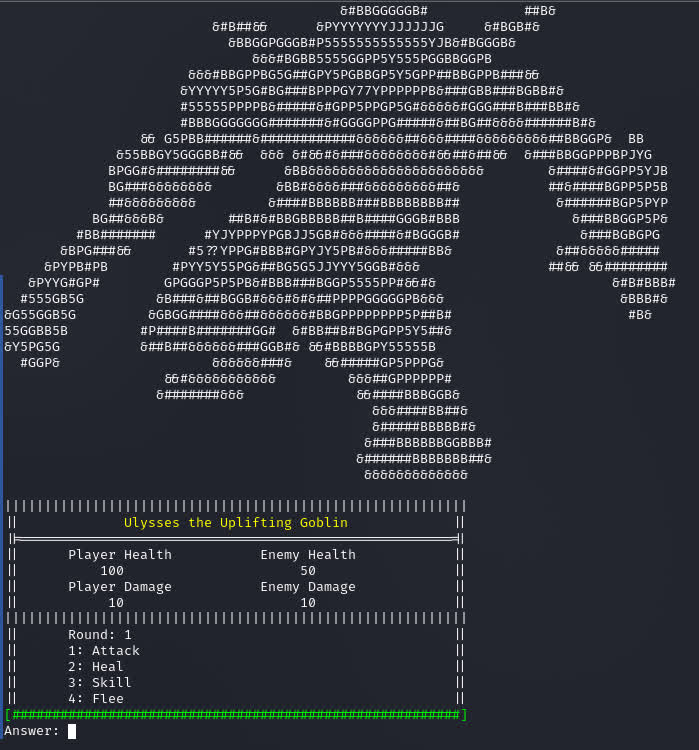
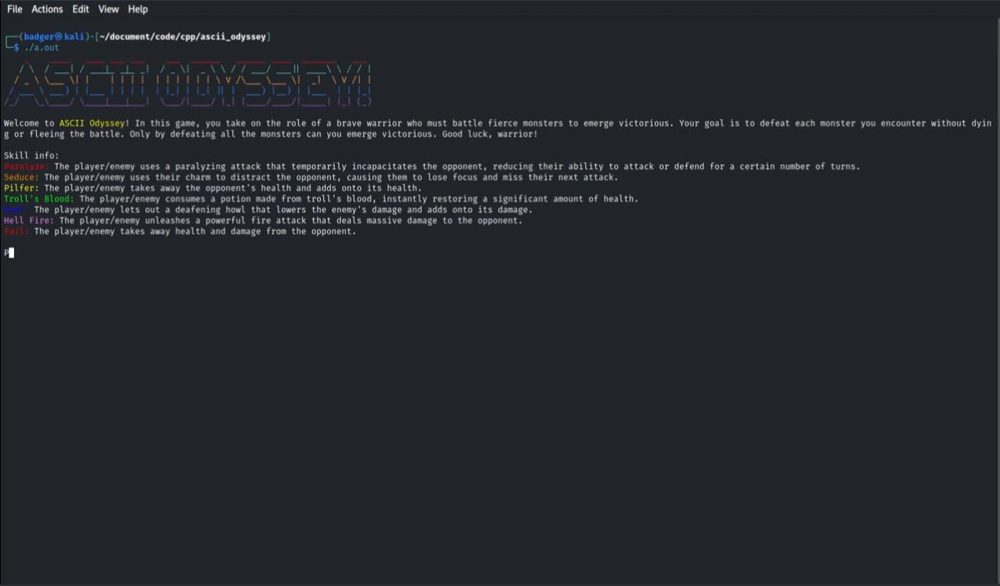

# ascii odyssey
terminal game made w/ c++. this game was started by 2 students for the CPT final project for AP CSP(computer science principles).

---

## gameplay



[](https://github.com/321BadgerCode/ascii_odyssey/assets/83559316/74d55652-1475-44a7-af04-a17dffdeb3fb)

## modes
* **campaign**: walk around the map and complete quests given by NPCs that occupy the region. watch out for pesky 'lil monsters lurking in the shadows!
* **arena**: fight various enemies, such as:
	1. goblin
	1. troll
	1. werewolf
	1. vampire
	1. dragon
	1. lich
	1. math_teacher

## lore
> maybe math teacher created monsters w/ science

The game is set in a world where magic and technology coexist, and the land is populated by various monsters such as goblins, trolls, and dragons. However, the monsters were once peaceful and coexisted with humans until a mysterious figure known as the Math Teacher rose to power.

The Math Teacher was once a respected member of society, known for their intelligence and teaching abilities. However, the Math Teacher became obsessed with the idea of creating a perfect society through the power of mathematics. They began to gather followers, including many of the monsters, and eventually seized control of the land.

As the chosen hero, you must venture forth and confront the Math Teacher, battling your way through hordes of monsters and eventually facing off against the Math Teacher themselves. Along the way, you will meet allies who will aid you in your quest, and enemies who will seek to stop you.

## story
The game begins with the player character waking up in their small village, having been chosen by a mysterious prophecy to be the hero who will save the world. The player is tasked with finding an ancient artifact that has the power to defeat the Math Teacher and restore peace to the land.

As the player sets out on their journey, they encounter various monsters, such as goblins, trolls, and dragons, who have been brainwashed by the Math Teacher's teachings. They also meet allies, such as a wise old sage who teaches the player new skills and abilities, and a rogue who offers to join the player's party.

As the player progresses through the game, they learn that the Math Teacher has been manipulating events from behind the scenes, attempting to thwart the hero's quest. The Math Teacher has created various mathematical puzzles and challenges that the player must solve in order to progress. The player must also overcome obstacles and enemies to reach the Math Teacher's castle, where they fight.

## original game name ideas
* ASCII Arena
* Terminal Tussle
* Battle Blitz
* Monster Melee
* Dungeon Duel
* ASCII Adventure
* C++ Combat
* Terminal Titans
* Enemy Encounter
* Monster Mash-up

<center><h3>main name competitors:</h3></center>

```diff
+ Ascii Odyssey
- Ascii Arena
```

## how attack & heal is calculated
> **NOT UP TO DATE: switched from linear congruential RNG to mersenne twister!!!**<sub>([./src/etc.h](./src/etc.h))</sub>
```math
%get_random.
\begin{align*}
\textcolor{yellow}{\text{get\_random}}(\textcolor{lightblue}{\text{max}}, \textcolor{lightblue}{\text{min}}, \textcolor{lightblue}{\text{seed}}) &: \\
& \quad \textcolor{lightblue}{\text{random\_number}} \gets (\textcolor{lightblue}{\text{seed}} \times \textcolor{lightblue}{\text{a}} + \textcolor{lightblue}{\text{c}}) \mod \textcolor{lightblue}{\text{m}} \\
& \quad \textcolor{lightblue}{\theta} \gets \frac{\textcolor{lightblue}{\text{random\_number}}}{\textcolor{lightblue}{\text{m}}} \times (\textcolor{lightblue}{\text{max}} - \textcolor{lightblue}{\text{min}}) + \textcolor{lightblue}{\text{min}} \\
& \quad \textcolor{purple}{\text{return}} \ \textcolor{lightblue}{\theta} \\\\
\end{align*} \\

%constraint ineq..
\textcolor{lightblue}{max} \geq \textcolor{lightblue}{min}, \quad \textcolor{lightblue}{min} \in \mathbb{W}
```

**Glossary:**

* $\textcolor{lightblue}{\text{a}}$: Multiplier.
* $\textcolor{lightblue}{\text{c}}$: Increment.
* $\textcolor{lightblue}{\text{m}}$: Modulus.

```math
%attack.
\begin{align*}
\textcolor{yellow}{\text{attack}}(\textcolor{lightblue}{\text{character}}) &: \\
& \quad \textcolor{lightblue}{\text{min}} \gets \textcolor{lightblue}{\text{damage}} - \frac{\textcolor{lightblue}{\text{damage}}}{4} \\
& \quad \textcolor{lightblue}{\text{damageTaken}} \gets \textcolor{lightblue}{\text{get\_random}}(\textcolor{lightblue}{\text{min}}, \textcolor{lightblue}{\text{min}} + \textcolor{lightblue}{\text{damage}}) \\
& \quad \textcolor{lightblue}{\text{character.health}} \gets \textcolor{lightblue}{\text{character.health}} - \textcolor{lightblue}{\text{damageTaken}} \\
\end{align*}
```

```math
%heal.
\begin{align*}
\textcolor{yellow}{\text{heal}}(\textcolor{lightblue}{\text{character}}) &: \\
& \quad \textcolor{lightblue}{\text{max}} \gets \left\lfloor \frac{\textcolor{lightblue}{\text{health\_max}}}{5} \right\rfloor \\
& \quad \textcolor{lightblue}{\text{healthGiven}} \gets \textcolor{lightblue}{\text{get\_random}}\left(\frac{\textcolor{lightblue}{\text{max}}}{2}, \textcolor{lightblue}{\text{max}}\right) \\
& \quad \textcolor{lightblue}{\text{character.health}} \gets \textcolor{lightblue}{\text{character.health}} + \textcolor{lightblue}{\text{healthGiven}} \\
\end{align*}
```

## map region name ideas
1. **Goblin**:
	* Goblin Grotto
	* Goblin Grove
	* Goblin Glade
	* Goblin Gulch
	* Goblin Gorge

1. **Troll**:
	* Troll Tundra
	* Troll Timberland
	* Troll Territory
	* Troll Thicket
	* Troll Trail

1. **Werewolf**:
	* Werewolf Woods
	* Werewolf Warren
	* Werewolf Wilds
	* Werewolf Wasteland
	* Werewolf Watch

1. **Vampire**:
	* Vampire Valley
	* Vampire Vista
	* Vampire Veil
	* Vampire Village
	* Vampire Vault

1. **Dragon**:
	* Dragon's Den
	* Dragon Domain
	* Dragon's Dale
	* Dragon's Descent
	* Dragon's Drift

1. **Lich**:
	* Lich's Lair
	* Lich's Labyrinth
	* Lich's Library
	* Lich's Lost Land
	* Lich's Legacy

1. **Math Teacher**:
	* Numerical Nexus
	* Algebra Arena
	* Geometric Glade
	* Trigonometry Terrace
	* Calculus Corner

## map
> `./asset/map/2.txt` shows how `o` represents the player and the `#` characters represent the boundaries where the player cannot go through.
> the player can move throughout the map w/ the `wasd` keys and then typing `enter`.
```
Haunted Mansion
########################################
#                                      #
#                                      #
#    #############################     #
#    #                           #     #
#    #                           #     #
#    #                           #     #
#    #                           #     #
#    #             ############# #     #
#    #             #           # #     #
#    #             #           # #     #
#    #             #           # #     #
#    #             #           # #     #
#    #             #           # #     #
#    #             #           # #     #
#    #             #           # #     #
#    #             #    o      # #     #
#    #             #           # #     #
#    #             #           # #     #
#    ###############           # #     #
#                               #      #
#                               #      #
########################################
```
